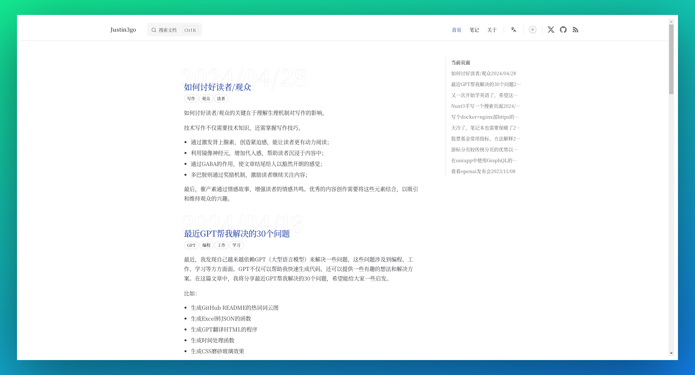

<h4 align="right"><strong>English</strong> | <a href="./README.zh.md">简体中文</a> </h4>

<div align="center">

<a href="https://justin3go.com" target="blank">
  
</a>

# Justin3go Blog


A fully-featured, modern, and elegantly simple static blog based on VitePress; it mainly records ✍️ my blog and notes.

Releases will be made once every weekend/Saturday if there are updates. Article publications and website modifications will be recorded in the releases. Feel free to star/watch (custom->release) to stay updated on the latest news~

[](./CHANGELOG.md)


[](https://github.com/Justin3go/justin3go.com/pulls)
[](https://github.com/Justin3go/justin3go.com/issues/new/choose)
[](https://github.com/Justin3go/justin3go.com/issues/new/choose)



</div>

## Features

1. 🌓 Provides a dark/light mode toggle for different reading environments.
2. 📖 Supports blog pagination, summaries, and tags for convenient user navigation.
3. 🌍 Supports a bilingual interface in Chinese and English for users of different languages.
4. 📡 Offers RSS subscription functionality, supporting content updates in both Chinese and English.
5. 💬 Integrates the Giscus commenting system for user interaction and feedback.
6. 🖼️ Supports high-definition image previews for an optimized visual experience.
7. 📜 Allows custom font settings to enhance reading comfort.
8. 🔍 Implements SEO optimizations, including Sitemap generation and support for Twitter Cards and Open Graph tags to improve search engine visibility.

## Development

```bash
git clone git@github.com:Justin3go/justin3go.com.git
cd FAV0

npm i -g pnpm # If needed
pnpm i
pnpm docs:dev
```
1. Modify the Giscus comment configuration in the `giscus` settings of `.vitepress/theme/components/Comments.vue`;
2. Adjust the sidebar configuration, RSS settings, metadata configuration, etc., in the `utils` folder;
3. Change the relevant configurations in the `config` folder, mainly the title, description, and GA settings in the head;
4. Replace the content in the `posts/**` and `en/posts/**` directories with your own content;

## License

This repository is licensed under a dual license, namely the MIT License and the CC-BY-4.0 License:

- All `.md` files are licensed under CC-BY-4.0, and you must retain attribution rights.
- Other code files are licensed under the MIT License, and you can use them freely.

For specific details, please refer to the [LICENSE](./LICENSE) file.

## Old Version Blog

This blog has undergone many changes during the restructuring. If you prefer to view the old version of the blog, please visit:

[v0-9-5.justin3go-com.pages.dev](https://v0-9-5.justin3go-com.pages.dev/)
